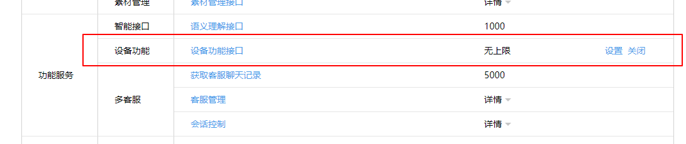

## BLE 设备连接微信

### 微信平台
#### 微信公众平台接口测试帐号申请
- 使用微信扫一扫登陆[微信公众平台](https://mp.weixin.qq.com/debug/cgi-bin/sandbox?t=sandbox/login)。


- 登录成功后会显示测试号信息，**appID** 和 **appsecret** 。


#### 开启设备功能接口
- 点击框中出现的 “开启” （图中为已开启）。



#### 添加产品
- 设备功能接口开启后，会出现“设置”按钮，点击进入下一个界面，进行设备功能管理。


- 在该界面，点击“添加产品”按钮，为我们的计步器设备添加一个产品类别：


- 按照提示填入相关的信息：


- 点击“下一步”进入“产品能力登记”界面：


- 最后，点击“添加”按钮，将产品添加进去。之后会在产品管理中看到添加的产品信息，**product_id** 。


#### 授权设备
- 将 appID 和 appsecret 替换图中的 Key 对应的 Value 。
- 服务器会返回一个 **access_token** 。


#### 为设备生成一个唯一ID（deviceid）及二维码（通过微信扫描即可添加设备）
- **每生成一次占用一个配额**。
- 将 access_token 和 product_id 替换图中的 Key 对应的 Value 。
- 服务器会返回一个 **qrticket** （二维码网站）和 **deviceid**。


#### 设备鉴权
- 将 access_token 和 product_id 替换图中的 Key 对应的 Value 。
- 将 deviceid 替换图中的 id ，mac 填写蓝牙设备的 MAC 地址。
- 服务器会返回授权结果，查看 errcode 和 errmsg 。errcode = 0 和 errmsg = "OK" 时表示授权成功了。
- **利用 deviceid 更新设备属性时，ble_simple_protocol 填 0，op_type 填 1。**


- 字段含义：

|字段|是否必须|描述|
|:---:|:---:|:---:|
|access_token|是|调用接口凭证|
|device_num|是|设备 ID 的个数|
|device_list|是|设备 ID 的列表，json 的 array 格式，其 size 必须等于 device_num|
|id|是|设备的 deviceid|
|mac|是|设备的 MAC 地址，格式采用 16 进制串（长度为 6 字节，不需要写前缀 '0x')|
|connect_protocol|是|1:Android Classic bluetooth; 2:iOS Classic bluetooth; 3:BLE; 4:Wi-Fi|
|auth_key|是|auth 及通信的加密 Key|
|close_strategy|是|断开策略，1：退出公众号页面即断开连接；2：退出公众号之后保持连接不断开|
|conn_strategy|是|连接策略，32位整型，按 bit 位置位，目前仅 1 和 3 bit 位有效，且 bit 位可以按位或置位。1 bit：在公众号对话页面，不停的尝试连接设备；4 bit：处于非公众号页面，微信自动连接。当用户切换微信到前台时，可能尝试去连接设备，连上一段时间后会断开|
|crypt_method|是|auth 加密方法，0：不加密；1：AES 加密（CBC 模式，PKCS7 填充方式）|
|auth_ver|是|auth version 设备和微信进行 auth 时，会根据版本号来确认 auth buf 和 auth key 的格式（各 version 对应的 auth buf 及 key 的具体格式可以参看“客户端蓝牙外设协议”），该字段目前支持取值：0：不加密的 version；1：version 1|
|manu_mac_pos|是|表示 MAC 地址在厂商广播 manufature data 里含有 MAC 地址的偏移，取值如下：-1 表示在尾部、-2 表示不包含 MAC 地址、其他值为非法偏移|
|ser_mac_pos|是|表示 MAC 地址在厂商 serial number 里含有 MAC 地址的偏移，取值如下:-1 表示在尾部、-2 表示不包含 MAC 地址、其他值为非法偏移|
|ble_simple_protocol|否|精简协议类型，取值如下：计步设备精简协议：1（若该字段填 1，connect_protocol 必须包括 3.非精简协议设备切勿填写该字段）|
|op_type|否|请求操作的类型，限定取值为：1：设备更新（更新已授权设备的各属性值）|
|product_id|是|设备 ID|

#### 使用手机微信绑定设备
- 使用微信扫一扫，扫描刚才获得的二维码，点击“绑定设备”，即可添加设备。

### BLE 设备

要符合[微信蓝牙精简协议](http://iot.weixin.qq.com/wiki/new/index.html?page=4-3)。

#### BLE 设备广播要求
- BLE 设备广播包里要符合**设备鉴权**配置，即广播包要包含 BLE 设备的 MAC 地址和包含微信的 Service UUID：0xFEE7。

#### BLE 设备 Service 和 Characteristic 要求
- BLE 设备包含 5 个 Characteristic：

|Characteristic UUID|权限|说明|
|:---:|:---:|:---:|
|0xFEC7|Write|Write Characteristic|
|0xFEC8|Indicate|Indicate Characteristic|
|0xFEC9|Read|内容为 6 字节 MAC 地址（iOS 系统其他软件连上设备之后，微信会去读该特征值，以确定设备 MAC 地址）。
|0xFEA1|Read;Indicate 和 Notify二选一，也可都支持|current_pedometer_measurement, 实时计步信息，包括：步数，距离，卡路里|
|0xFEA2|Read;Write;Indicate|target，运动目标|
 
#### 特征值内容
- 所有特征值内容里面的字节序都为小端字节序。
##### current_pedometer_measurement 的值由 4 部分组成
|值|类型|说明|
|:---:|:---:|:---:|
|Flag|Unit8|0x01：步数（必选） 0x02：距离（可选） 0x04：卡路里（可选） 如0x05表示含有步数和卡路里|
|StepCount|Uint24|步数|
|StepDistancer|Uint24|走了多远，单位米|
|StepCalorie|Uint24|卡路里|
- 说明：
1.距离和卡路里是可选的，可能出现也可能不出现
如果只有步数，那么值为：01 （步数）10 27 00（1万步）
如果有步数和距离，那么值为：03（步数，距离）10 27 00（1万步）70 17 00（6公里）
其他情况以此类推。
2.时间值以手机时间为标准，即手机收到数据的那一刻就认为是这个数据的时间。

##### target 的值为
|值|类型|说明|
|:---:|:---:|:---:|
|Flag|Uint8|0x01：步数（必选）|
|StepCount|Uint24|步数|

- 说明：
1.如目标为一万步，那么值为：01（步数） 10 27 00（1万步）
如果手机往设备写入目标值，设备要更新。如果设备更新了目标值，要通知手机。

#### nRF51822 Wechat Service 代码
``` c
// ble_wechat_service.c start
#include "ble_wechat_service.h"

static uint32_t step_target = WECHAT_STEP_START_VALUE;

uint32_t get_current_step(void)
{
	return step_target;
}

uint32_t send_step_to_app(ble_wechat_t *p_wechat)
{
	ble_gatts_hvx_params_t hvx_params;
	uint32_t step = 0;
	
	uint8_t buffer[4] = {0x01, 0x00, 0x00, 0x00};
	uint16_t length = 4;
	
	step = get_current_step();
	
	app_trace_log("Sent step:%d to App\r\n", step);
	
	buffer[1] = (uint8_t)(step & 0x000000FF);
	buffer[2] = (uint8_t)(step >> 8);
	buffer[3] = (uint8_t)(step >> 16);
	
	memset(&hvx_params, 0, sizeof(hvx_params)); 
	
	hvx_params.handle = p_wechat->pedometer_handles.value_handle;
	hvx_params.p_data = buffer;
	hvx_params.p_len  = &length;
	hvx_params.type   = BLE_GATT_HVX_INDICATION;

	return sd_ble_gatts_hvx(p_wechat->conn_handle, &hvx_params);
}

uint32_t power(uint32_t base, uint8_t times)
{
	uint32_t i, rslt = 1;
	
	for(i = 0; i < times; i++)
	{
		rslt *= base;
	}
	
	return rslt;
}

uint32_t bcd_to_dec(uint8_t *bcd, uint16_t length)
{
	uint32_t temp = 0, dec = 0;
	
	for(uint8_t i = 0; i < length; i++)
	{
		temp = ((bcd[i] >> 4) & 0x0F) * 10 + (bcd[i] & 0x0F);
		dec += temp * power(100, length-1-i);
	}
	
	return dec;
}

void get_mac_addr(uint8_t *p_mac_addr)
{
	uint32_t error_code;
	ble_gap_addr_t p_mac_addr_t;
	
	error_code = sd_ble_gap_address_get(&p_mac_addr_t);
	APP_ERROR_CHECK(error_code);

#if 0 // mac address LSB or MSB
	for ( uint8_t i = 6; i > 0; )
	{	
		i--;
		p_mac_addr[5-i]= p_mac_addr_t.addr[i];
	}
#else
	memcpy(p_mac_addr, p_mac_addr_t.addr, 6);
#endif
}

//Add WeChat Service to GATTS sercvice
uint32_t ble_wechat_add_service(ble_wechat_t *p_wechat)
{
	uint32_t err_code;
	ble_uuid_t ble_wechat_uuid;
	
	BLE_UUID_BLE_ASSIGN(ble_wechat_uuid, BLE_UUID_WECHAT_SERVICE);
	err_code = sd_ble_gatts_service_add(BLE_GATTS_SRVC_TYPE_PRIMARY, &ble_wechat_uuid, &p_wechat->service_handle);
	return err_code;
}

//Add the indicate characteristic 
uint32_t ble_wechat_add_indicate_char(ble_wechat_t *p_wechat)
{
	ble_uuid_t          char_uuid;
	ble_gatts_attr_md_t	attr_md;
	ble_gatts_char_md_t	char_md;
	ble_gatts_attr_t	attr_char_value;
	char *data          = "indicate char";
	
	memset(&char_md, 0, sizeof(char_md));

    char_md.char_props.indicate = 1;
    char_md.p_char_user_desc  = NULL;
    char_md.p_char_pf         = NULL;
    char_md.p_user_desc_md    = NULL;
    char_md.p_cccd_md         = NULL;
    char_md.p_sccd_md         = NULL;

    BLE_UUID_BLE_ASSIGN(char_uuid, BLE_UUID_WECHAT_INDICATE_CHARACTERISTICS);

    memset(&attr_md, 0, sizeof(attr_md));

    BLE_GAP_CONN_SEC_MODE_SET_OPEN(&attr_md.read_perm);
    BLE_GAP_CONN_SEC_MODE_SET_OPEN(&attr_md.write_perm);

    attr_md.vloc    = BLE_GATTS_VLOC_STACK;
    attr_md.rd_auth = 0;
    attr_md.wr_auth = 0;
    attr_md.vlen    = 1;

    memset(&attr_char_value, 0, sizeof(attr_char_value));

    attr_char_value.p_uuid    = &char_uuid;
    attr_char_value.p_attr_md = &attr_md;
    attr_char_value.init_len  = strlen(data);
    attr_char_value.init_offs = 0;
    attr_char_value.max_len   = BLE_WECHAT_MAX_DATA_LEN;
	attr_char_value.p_value   = (uint8_t *)data;

	return sd_ble_gatts_characteristic_add(p_wechat->service_handle,
									   &char_md,
									   &attr_char_value,
									   &p_wechat->indicate_handles);
}

//Add the write characteristic 
uint32_t ble_wechat_add_write_char(ble_wechat_t *p_wechat)
{
	ble_uuid_t          char_uuid;
	ble_gatts_attr_md_t	attr_md;
	ble_gatts_char_md_t	char_md;
	ble_gatts_attr_t	attr_char_value;
	char *data          = "write char";
	
	memset(&char_md, 0, sizeof(char_md));

    char_md.char_props.write  = 1;
    char_md.p_char_user_desc  = NULL;
    char_md.p_char_pf         = NULL;
    char_md.p_user_desc_md    = NULL;
    char_md.p_cccd_md         = NULL;
    char_md.p_sccd_md         = NULL;
	

    BLE_UUID_BLE_ASSIGN(char_uuid, BLE_UUID_WECHAT_WRITE_CHARACTERISTICS);

    memset(&attr_md, 0, sizeof(attr_md));

    BLE_GAP_CONN_SEC_MODE_SET_OPEN(&attr_md.read_perm);
    BLE_GAP_CONN_SEC_MODE_SET_OPEN(&attr_md.write_perm);

    attr_md.vloc    = BLE_GATTS_VLOC_STACK;
    attr_md.rd_auth = 0;
    attr_md.wr_auth = 0;
    attr_md.vlen    = 1;

    memset(&attr_char_value, 0, sizeof(attr_char_value));

    attr_char_value.p_uuid    = &char_uuid;
    attr_char_value.p_attr_md = &attr_md;
    attr_char_value.init_len  = strlen(data);
    attr_char_value.init_offs = 0;
    attr_char_value.max_len   = BLE_WECHAT_MAX_DATA_LEN;
	attr_char_value.p_value   = (uint8_t *)data;

	return sd_ble_gatts_characteristic_add(p_wechat->service_handle,
									   &char_md,
									   &attr_char_value,
									   &p_wechat->write_handles);
}

//Add the pedometer characteristic 
uint32_t ble_wechat_add_pedometer_char(ble_wechat_t *p_wechat)
{
	ble_uuid_t          char_uuid;
	ble_gatts_attr_md_t	attr_md;
	ble_gatts_char_md_t	char_md;
	ble_gatts_attr_t	attr_char_value;
	char data[4]          = {0x01, 0x10, 0x27, 0x00};// 10000
	
	memset(&char_md, 0, sizeof(char_md));

    char_md.char_props.indicate		= 1;
    char_md.char_props.read			= 1;
    char_md.p_char_user_desc		= NULL;
    char_md.p_char_pf         		= NULL;
    char_md.p_user_desc_md    		= NULL;
    char_md.p_cccd_md         		= NULL;
    char_md.p_sccd_md         		= NULL;	

    BLE_UUID_BLE_ASSIGN(char_uuid, BLE_UUID_WECHAT_PEDOMETER_CHARACTERISTICS);

    memset(&attr_md, 0, sizeof(attr_md));

    BLE_GAP_CONN_SEC_MODE_SET_OPEN(&attr_md.read_perm);
    BLE_GAP_CONN_SEC_MODE_SET_OPEN(&attr_md.write_perm);

    attr_md.vloc    = BLE_GATTS_VLOC_STACK;
    attr_md.rd_auth = 0;
    attr_md.wr_auth = 0;
    attr_md.vlen    = 1;

    memset(&attr_char_value, 0, sizeof(attr_char_value));

    attr_char_value.p_uuid    = &char_uuid;
    attr_char_value.p_attr_md = &attr_md;
    attr_char_value.init_len  = 4;
    attr_char_value.init_offs = 0;
    attr_char_value.max_len   = BLE_WECHAT_MAX_DATA_LEN;
	attr_char_value.p_value   = (uint8_t *)data;

	return sd_ble_gatts_characteristic_add(p_wechat->service_handle,
									   &char_md,
									   &attr_char_value,
									   &p_wechat->pedometer_handles);
}

//Add the target characteristic 
uint32_t ble_wechat_add_target_char(ble_wechat_t *p_wechat)
{
	ble_uuid_t          char_uuid;
	ble_gatts_attr_md_t	attr_md;
	ble_gatts_char_md_t	char_md;
	ble_gatts_attr_t	attr_char_value;
	char data[4]          = {0x01, 0x50, 0xC3, 0x00};// 50000
	
	memset(&char_md, 0, sizeof(char_md));

    char_md.char_props.indicate		= 1;
    char_md.char_props.read			= 1;
	char_md.char_props.write        = 1;
    char_md.p_char_user_desc		= NULL;
    char_md.p_char_pf         		= NULL;
    char_md.p_user_desc_md    		= NULL;
    char_md.p_cccd_md         		= NULL;
    char_md.p_sccd_md         		= NULL;	

    BLE_UUID_BLE_ASSIGN(char_uuid, BLE_UUID_WECHAT_TARGET_CHARACTERISTICS);

    memset(&attr_md, 0, sizeof(attr_md));

    BLE_GAP_CONN_SEC_MODE_SET_OPEN(&attr_md.read_perm);
    BLE_GAP_CONN_SEC_MODE_SET_OPEN(&attr_md.write_perm);

    attr_md.vloc    = BLE_GATTS_VLOC_STACK;
    attr_md.rd_auth = 0;
    attr_md.wr_auth = 0;
    attr_md.vlen    = 1;

    memset(&attr_char_value, 0, sizeof(attr_char_value));

    attr_char_value.p_uuid    = &char_uuid;
    attr_char_value.p_attr_md = &attr_md;
    attr_char_value.init_len  = 4;
    attr_char_value.init_offs = 0;
    attr_char_value.max_len   = BLE_WECHAT_MAX_DATA_LEN;
	attr_char_value.p_value   = (uint8_t *)data;

	return sd_ble_gatts_characteristic_add(p_wechat->service_handle,
									   &char_md,
									   &attr_char_value,
									   &p_wechat->target_handle);
}

//Add the read characteristic 
uint32_t ble_wechat_add_read_char(ble_wechat_t *p_wechat)
{
	ble_uuid_t          char_uuid;
	ble_gatts_attr_md_t	attr_md;
	ble_gatts_char_md_t	char_md;
	ble_gatts_attr_t	attr_char_value;
	uint8_t 			mac_addr[BLE_GAP_ADDR_LEN];
	
	memset(&char_md, 0, sizeof(char_md));

	char_md.char_props.read	    = 1;
    char_md.p_char_user_desc  = NULL;
    char_md.p_char_pf         = NULL;
    char_md.p_user_desc_md    = NULL;
    char_md.p_cccd_md         = NULL;
    char_md.p_sccd_md         = NULL;
	
	get_mac_addr(mac_addr);

    BLE_UUID_BLE_ASSIGN(char_uuid, BLE_UUID_WECHAT_READ_CHARACTERISTICS);

    memset(&attr_md, 0, sizeof(attr_md));

    BLE_GAP_CONN_SEC_MODE_SET_OPEN(&attr_md.read_perm);
    BLE_GAP_CONN_SEC_MODE_SET_OPEN(&attr_md.write_perm);

    attr_md.vloc    	= BLE_GATTS_VLOC_STACK;
    attr_md.rd_auth 	= 0;
    attr_md.wr_auth 	= 0;
    attr_md.vlen    	= 1;

    memset(&attr_char_value, 0, sizeof(attr_char_value));

    attr_char_value.p_uuid    = &char_uuid;
    attr_char_value.p_attr_md = &attr_md;
    attr_char_value.init_len  = BLE_GAP_ADDR_LEN;
    attr_char_value.init_offs = 0;
    attr_char_value.max_len   = BLE_GAP_ADDR_LEN;
	attr_char_value.p_value   = mac_addr;

	return sd_ble_gatts_characteristic_add(p_wechat->service_handle,
									   &char_md,
									   &attr_char_value,
									   &p_wechat->read_handles);
}

//Add the WeChat characteristic include indicate write and read characteristic
uint32_t ble_wechat_add_characteristics(ble_wechat_t *p_wechat)
{
	uint32_t err_code;
	
	err_code = ble_wechat_add_indicate_char(p_wechat);
	APP_ERROR_CHECK(err_code);
	err_code = ble_wechat_add_write_char(p_wechat);
	APP_ERROR_CHECK(err_code);
	err_code = ble_wechat_add_read_char(p_wechat);
	APP_ERROR_CHECK(err_code);
	err_code = ble_wechat_add_pedometer_char(p_wechat);
	APP_ERROR_CHECK(err_code);
	err_code = ble_wechat_add_target_char(p_wechat);
	APP_ERROR_CHECK(err_code);

	return err_code;
}

uint32_t send_target_to_app(ble_wechat_t *p_wcs, uint32_t step)
{
	ble_gatts_hvx_params_t hvx_params;
	uint8_t buffer[4] = {0x01, 0x00, 0x00, 0x00};
	uint16_t length = 4;
	
	buffer[1] = (uint8_t)(step & 0x000000FF);
	buffer[2] = (uint8_t)(step >> 8);
	buffer[3] = (uint8_t)(step >> 16);
	
	memset(&hvx_params, 0, sizeof(hvx_params));
	
	hvx_params.handle = p_wcs->target_handle.value_handle;
	hvx_params.p_data = buffer;
	hvx_params.p_len  = &length;
	hvx_params.type   = BLE_GATT_HVX_INDICATION;

	return sd_ble_gatts_hvx(p_wcs->conn_handle, &hvx_params);
}

/**@brief     Function for handling the @ref BLE_GATTS_EVT_WRITE event from the S110 SoftDevice.
 *
 * @param[in] p_ble_evt Pointer to the event received from BLE stack.
 */
static void on_write(ble_wechat_t *p_wcs, ble_evt_t * p_ble_evt)
{
	ble_gatts_evt_write_t * p_evt_write = &p_ble_evt->evt.gatts_evt.params.write;
	
	if (p_evt_write->handle == p_wcs->target_handle.value_handle) 
	{
		if(p_evt_write->len == 4)
		{
			step_target = 0;
			step_target |= p_evt_write->data[3] << 16;
			step_target |= p_evt_write->data[2] << 8;
			step_target |= p_evt_write->data[1];
		}
		else if(p_evt_write->len == 3) // 用户设置步数初始值
		{
			step_target = bcd_to_dec(p_evt_write->data, p_evt_write->len);
		}

		app_trace_log("Set Target: %d\r\n", step_target);
		send_target_to_app(p_wcs, step_target);
	}
	else
	{
		if((p_evt_write->handle == p_wcs->indicate_handles.cccd_handle)
			&&
		   (p_evt_write->len == 2)
		)
		{
			if(ble_srv_is_indication_enabled(p_evt_write->data))
			{
				app_trace_log("indicate_handles indication enabled\r\n");
			}
			else
			{
				app_trace_log("indicate_handles indication disabled\r\n");
			}	
		}
		else if((p_evt_write->handle == p_wcs->read_handles.cccd_handle)
			&&
		   (p_evt_write->len == 2)
		)
		{
			if(ble_srv_is_indication_enabled(p_evt_write->data))
			{
				app_trace_log("read_handles indication enabled\r\n");
			}
			else
			{
				app_trace_log("read_handles indication disabled\r\n");
			}
		}
		else if((p_evt_write->handle == p_wcs->pedometer_handles.cccd_handle)
			&&
		   (p_evt_write->len == 2)
		)
		{
			if(ble_srv_is_indication_enabled(p_evt_write->data))
			{
				app_trace_log("pedometer_handles indication enabled\r\n");
			}
			else
			{
				app_trace_log("pedometer_handles indication disabled\r\n");
			}
		}
		else if((p_evt_write->handle == p_wcs->target_handle.cccd_handle)
			&&
		   (p_evt_write->len == 2)
		)
		{
			if(ble_srv_is_indication_enabled(p_evt_write->data))
			{
				app_trace_log("target_handle indication enabled\r\n");
			}
			else
			{
				app_trace_log("target_handle indication disabled\r\n");
			}
		}
		else
		{
			app_trace_log("Recv handle %04X: \r\n", p_evt_write->handle);
			for(uint8_t i = 0; i < p_evt_write->len; i++)
			{
				app_trace_log("%02X ", p_evt_write->data[i]);
			}
			app_trace_log("\r\n");
		}
	}
}

void on_indicate_comfirm(ble_wechat_t *p_wcs, ble_evt_t * p_ble_evt)
{
	ble_gatts_evt_write_t * p_evt_write = &p_ble_evt->evt.gatts_evt.params.write;
	
	if (p_evt_write->handle == p_wcs->pedometer_handles.value_handle) 
	{
		app_trace_log("pedometer_handles =>");
		step_target += 1;
	}
	else if (p_evt_write->handle == p_wcs->target_handle.value_handle) 
	{
		app_trace_log("target_handle =>");
	}
	else
	{
		app_trace_log("p_evt_write->handle: 0x%04X =>", p_evt_write->handle);
	}
	for(uint8_t i = 0; i < p_evt_write->len; i++)
	{
		app_trace_log("%02X ", p_evt_write->data[i]);
	}
	app_trace_log("\r\n");
}

void ble_wechat_on_ble_evt(ble_wechat_t *p_wcs, ble_evt_t * p_ble_evt) 
{
	switch (p_ble_evt->header.evt_id)
    {
		case BLE_GAP_EVT_CONNECTED:
			p_wcs->conn_handle = p_ble_evt->evt.gap_evt.conn_handle;
			break;
        case BLE_GATTS_EVT_WRITE:
			app_trace_log("BLE_GATTS_EVT_WRITE\r\n");
            on_write(p_wcs, p_ble_evt);
            break;
        case BLE_GATTS_EVT_HVC:
			app_trace_log("BLE_GATTS_EVT_HVC\r\n");
			on_indicate_comfirm(p_wcs, p_ble_evt);
			break;	
		case BLE_GAP_EVT_DISCONNECTED:
			p_wcs->conn_handle = BLE_CONN_HANDLE_INVALID;
			break;
        default:
            break;
    }
}
// ble_wechat_service.c end

// ble_wechat_service.h start

#ifndef BLE_WECHAT_SERVICE
#define BLE_WECHAT_SERVICE

#include <string.h>
#include <stdint.h>
#include "ble.h"
#include "app_error.h"
#include "ble_conn_params.h"
#include "app_trace.h"
#include "app_timer.h"

#define WECHAT_STEP_START_VALUE							10000

#define BLE_UUID_WECHAT_SERVICE							0xFEE7
#define BLE_UUID_WECHAT_WRITE_CHARACTERISTICS 			0xFEC7
#define BLE_UUID_WECHAT_INDICATE_CHARACTERISTICS 		0xFEC8
#define BLE_UUID_WECHAT_READ_CHARACTERISTICS 			0xFEC9
#define BLE_UUID_WECHAT_PEDOMETER_CHARACTERISTICS 		0xFEA1
#define BLE_UUID_WECHAT_TARGET_CHARACTERISTICS 			0xFEA2
#define APP_ADV_INTERVAL                     40                                      /**< The advertising interval (in units of 0.625 ms. This value corresponds to 25 ms). */
#define APP_ADV_TIMEOUT_IN_SECONDS           0                                       /**< The advertising timeout in units of seconds. */
#define BLE_WECHAT_MAX_DATA_LEN              (GATT_MTU_SIZE_DEFAULT - 3) 			 /**<Set the Maximum Data length og WECHAT to the (GATT Maximum Transmission Unit -3) */


typedef struct
{
	uint16_t                   service_handle;
	ble_gatts_char_handles_t   indicate_handles;
	ble_gatts_char_handles_t   write_handles;
	ble_gatts_char_handles_t   read_handles;
	ble_gatts_char_handles_t   pedometer_handles;
	ble_gatts_char_handles_t   target_handle;
	uint16_t                   conn_handle; 
} ble_wechat_t;

uint32_t get_current_step(void);
uint32_t send_step_to_app(ble_wechat_t *p_wechat);
void get_mac_addr(uint8_t *p_mac_addr);
uint32_t ble_wechat_add_service(ble_wechat_t *p_wechat);
uint32_t ble_wechat_add_characteristics(ble_wechat_t *p_wechat);
void ble_wechat_on_ble_evt(ble_wechat_t *p_wcs, ble_evt_t * p_ble_evt);

#endif

// ble_wechat_service.h end
```


